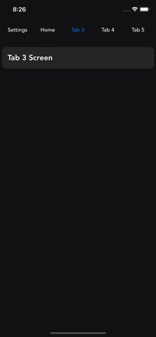
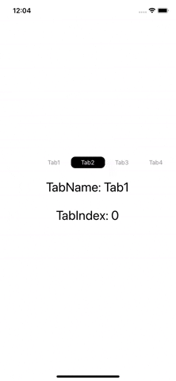

<div align="center">
    <h1> React Native Horizontal Scroll Menu </h1>
    <p>
      <i>A horizontally scrolling tab/picker component for React Native</i>
    </p>
</div>

|  Actual Project Usage      | Sample |
| :---:        |    :----:   |  
|       |    | 

## 🏁 Getting Started

```bash
npm i @nyashanziramasanga/react-native-horizontal-scroll-menu
```

or

```bash
yarn add @nyashanziramasanga/react-native-horizontal-scroll-menu
```

## 🧰 Usage

```javascript
import HorizontalScrollMenu, { RouteProps } from '@nyashanziramasanga/react-native-horizontal-scroll-menu/src';

 const [selectedIndex, setSelectedIndex] = useState(1);

  const NavigationTabs = [
    {
      id: 0,
      name: 'Tab1',
    },
    {
      id: 1,
      name: 'Tab2',
    },
    {
      id: 2,
      name: 'Tab3',
    },
    {
      id: 3,
      name: 'Tab4',
    },
    {
      id: 4,
      name: 'Tab5',
    },
  ];

const onPress = (route: RouteProps) => {
    setSelectedIndex(route.id);
    console.log('Tab pressed', route);
  };

  return (
    <HorizontalScrollMenu
      items={NavigationTabs}
      onPress={onPress}
      selected={selectedIndex}
      itemWidth={80}
      scrollAreaStyle={{ height: 50 }}
    />
  )
```

## ⚙️ Props

### Required

| Prop      | Description | Type     | Default    |
| :---        |    :----:   |          ---: |---: |
| items      | Array of tab items to be displayed       | Array<NavigationTabsProps>   |     |
| onPress   | Handle when a tab item is pressed        | (route: RouteProps) => void     |     |
| selected   | ident of tab item that is selected        | number    |   0  |

### Optional

| Prop      | Description | Type     | Default    |
| :---        |    :----:   |          ---: |---: |
| upperCase      | Change text to uppercase      | boolean  | false    |
| textStyle      | Style for menu items      | StyleProp<TextStyle>  |  #8C8C8C   |
| buttonStyle      | Style for menu buttons     | StyleProp<TextStyle>  | marginRight: 10    |
| activeTextColor      | Selected/active tab item text color      | string  | #ffffff |
| activeBackgroundColor      | Selected/active tab item background colour     | string | #000000   |
| scrollAreaStyle      | Style for the scroll area     | StyleProp<ViewStyle> | height: 50   |
| keyboardShouldPersistTaps      |    | boolean | always | never | handled | always  |
| itemWidth      | Width of each tab item    | number | 100   |

## Example

Clone the project and cd into `example` folder to see a sample

```bash
cd example

yarn / npm i

expo start
```